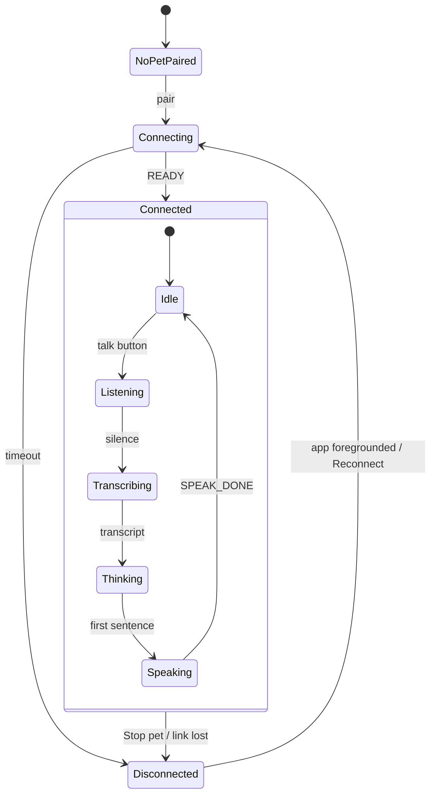

# PolyMO — Design

> **The product is called PolyMO** as of 2026-08-27, renamed from "Digital Pet".
> The name appears in four places that matter: the launcher label
> (`strings.xml`), the main surface header (`PetHeader`), the paired-device line
> in settings, and — this is the one with teeth — **the pet's advertised BLE
> name**, which is half the phone's scan filter and therefore a wire contract.
> §4's note below still holds: the header shows the PRODUCT name because the pet
> itself has none, and that is still undesigned. Older records in this file that
> say "Digital Pet" are history and are left standing as history.

Product and UX source of truth: the state model both surfaces render, the visual
identity, and the rules that have earned their place.

> **Status, 2026-08-07.** Every section is written and current, and **§5 is now
> built** — the one surface, all four settings sub-pages, the failure states and
> the off/on cycle. It was a deliberate stub until 2026-08-02 and shipped in a
> day once the Claude Design screens arrived, so it has moved from a design to a
> description faster than anything else here; where the two disagree, **§7.3 is
> the list of places the build deliberately left the mocks behind.**
>
> Still unbuilt: first run (§5.2) and mini-games (§5.6). This file was once a
> template whose placeholder palette leaked into the firmware; see §4 before
> using any colour from memory.

---

## 1. Product direction

### What this is becoming

A **virtual pet you actually keep alive**, whose wellbeing is tied to your real
screen time. It gets hungry and bored, it can be fed and played with, it grows
through life stages, and it can die and be reset. Exceeding a screen-time
threshold makes it sick — and staying sick is what kills it.

That reframes what exists today. The voice conversation is not the product; it is
**how the pet talks**. Screen-time monitoring is not a feature; it is **the
pet's environment**. The phone stops being a chat app with a pet attached and
becomes a care app that the pet can also speak through.

Three things are worth being honest about. This is really three products —
companion, virtual pet, screen-time tool — and the pet is the one that gives the
other two a reason to exist. The chat may end up the least important. And the
simulation is what makes this *yours*: most virtual pets invent their needs,
while this one has a need tied to something real.

### The four structural decisions

Settled before building, because both prototyping and IA would otherwise bake in
an answer by accident.

**1. The pet owns its own life.** Simulation state is authoritative on the
device, not the phone. It already has everything required: NVS for persistence,
a PCF85063 RTC for time, an AXP2101 for battery awareness, and its own screen,
touch, mic, speaker and IMU. A pet whose life pauses when you close an app is a
remote display, not a pet — and it would contradict the architecture the app was
just rebuilt around, where the pet works with no screen present.

The phone contributes what only it can see: screen time, language, and the
models. Those are **inputs**, not a reason to move the state.

**2. Time passes even while the pet is off.** The RTC is powered from the LiPo
via the AXP2101 and keeps running when the device is switched off at the PWR
button, so the pet can know it was neglected. A backup cell on the reserved pads
covers main-battery replacement and a flat battery.

**The pet is preserved across a flat battery.** Its state lives in flash and
survives regardless; only the clock is at risk. So the clock must be treated as
fallible: PCF85063 exposes an oscillator-stop / low-voltage flag, and boot must
check it. A pet that ages forty years overnight because it read a garbage
timestamp is the failure to design against.

**3. Screen time is a sensor, not a feature.** It feeds the simulation rather
than sitting beside it. Today's path — usage alert → LLM nudge → notification —
becomes: usage event → simulation changes → **the pet visibly reacts**, with the
LLM optionally commenting. The pet getting sick is the message; text is the
garnish.

**The allowance is per SITTING, not per day** — settled 2026-08-07 while
building §2e's screen, because the screen forced the question. `ScreenTime`
compares `now - lastResume` against it, so it limits how long you may stay in an
app in one go.

**That is what makes the pet recoverable.** Put the phone down and it gets
better; a cumulative daily budget never falls, so a pet made ill at 11am could
not recover until midnight, and the loop would stop being a loop.

The consequence for any screen showing this: a day's total and a per-sitting
allowance are **different quantities**, so nothing may quietly imply they are the
same one (§5.0 rule 2).

**The first build over-corrected and it was worse.** It refused the design's
"37 m / 25 m" pairing entirely and stated the day alone — "34 m today" — which
is unimpeachable and useless, because knowing whether 34 is a lot means holding
a number that is not on the screen. Reported as difficult to interpret, and it
was.

The rule that came out of that, and it generalises past this screen: **the risk
was never that the two numbers appear together, it was that nothing said they
are measured differently.** So they appear together, as `2 / 5 min today`, under
a column heading that says exactly which is which — *today / allowance per
sitting*. The heading is load-bearing rather than decorative: without it the
fraction reads as a budget again.

**Red arrives when the bar completely fills, and that is `>=` rather than `>`.**
`ScreenTime.overusingPackage` tests `now - lastResume >= threshold`, so the pet
falls ill *at* the allowance. A display waiting for strictly-greater would call
the pet healthy at the moment it started being made ill — a small edge that is
the difference between the screen agreeing with the simulation and merely
looking as though it does. The colour is derived from the bar's own fill, so
"full" and "red" cannot drift into disagreement.

**4. The LLM is the pet's voice.** Simulation state goes into the system prompt
so replies come *from* its condition — a hungry pet says it is hungry, without
being told to. Cheap to build, and most of the charm lives there.

### The simulation

Two scores, one condition, one derived mood. Everything the pet *is* comes from
these; everything else is presentation.

#### The two scores

| Score | Range | Raised by | Gesture | Lowered by |
|---|---|---|---|---|
| **Satiety** | 0–4 | feeding | **double tap** | slow decay; sharply while sick |
| **Happiness** | 0–4 | playing | **shake, held 3 s** | slow decay; sharply while sick |

**Both gestures are deliberately awkward, and rate-limited.** A single tap and a
single accelerometer threshold crossing were both trivial to trigger by
accident — setting the pet down, brushing the screen, knocking the desk. A
double tap and a sustained three-second shake cannot happen by mistake, and cost
an attentive user nothing.

A **5-second cooldown** on each action follows from the same thought. It stops a
misread gesture being amplified into a full score. The cooldown lives in the
simulation rather than the gesture code, so every future input — the phone, a
mini-game — inherits it.

> **Changed 2026-08-04, from 60 seconds, and it gave something up.** The original
> minute had a second job: it made tending the pet *take a moment*, because
> filling an empty score is four actions and a minute apart made that a few
> minutes of attention rather than four taps and done. At five seconds the same
> four actions take twenty, so care is now a brief interaction rather than a
> paced one. Deliberate. If the loop later feels too frictionless — a pet that
> can be topped up to full the instant you glance at it — this is the first
> number to look at, and the argument for the longer value is the paragraph
> above rather than anything new.
>
> **Exercised on hardware 2026-08-04.** It was flashed while the pet was full, so
> for a day the five seconds were a build-time claim rather than a measurement.
> Feeding a pet that had room confirms it: the second feed lands five seconds
> after the first, not sixty. The frictionlessness above is therefore a real
> property of the product now and not a prediction.

The cooldown is **waived entirely while a score is 0**, so it only ever paces
topping up a healthy pet. A pet that calls for food and then refuses it is simply
broken.

**Both run in the same direction: higher is better, 0 is bad.** That consistency
is the reason the second one is called *satiety* rather than *hunger*.

**THE SCORES ARE WHOLE NUMBERS AND MUST NEVER BE SHOWN AS PARTIAL** (decided
2026-08-07). They are integers 0–4 in the firmware, integers 0–4 on the wire, and
they change a whole level at a time — so any rendering that implies a fraction is
showing precision the system does not have and cannot acquire.

This is worth stating because the redesign nearly imported the opposite. The
Claude Design main surface replaces the old pips with segmented meters, which is
the right change, but justified as *"a bar can show a partial level the pips
can't"* — and the design's own markup then correctly draws **four discrete
segments**. The visual is right and the reason given for it is not, which is the
combination most likely to mislead somebody later: a continuous bar looks like an
obvious improvement on a segmented one right up until it implies a half-full
stomach that no part of the system can express.

So: four segments, each wholly filled or wholly empty. If a future version wants
smoothness it needs the *simulation* to carry fractions first, which is a
different and much larger decision than a bar.

> **Naming decision, worth a veto if you disagree.** The spec said "feeding the
> pet increases the hunger score", so a high hunger score means well-fed. That
> inverts the ordinary meaning of the word, and someone will eventually write
> `if (hunger > 3) starving()` — a bug that reads correctly. *Satiety* removes
> the trap: 0 is starving, 4 is full, same direction as happiness, and "both at
> 0 means death" reads naturally. If "hunger" is preferred as the user-facing
> word, keep it in the UI and keep `satiety` in the code.

**Death: both scores at 0, continuously, for an extended period.** `AND`, not
`OR` — a starving but entertained pet survives, and so does a well-fed miserable
one. That is deliberately merciful; neglect has to be total.

Death should set a flag rather than wipe the saved state, so the pet can be shown
as dead and **reset stays an explicit user action**. A pet that silently respawns
has no stakes.

#### Sick — a condition, not a mood

Sick is an **event with a start and an end**, and it is a third kind of thing:
neither an emotion nor a system state, but a simulation condition.

| | |
|---|---|
| **Starts** | the user exceeds a screen-time threshold on a tracked app |
| **Ends** | the user closes that app, **or** the pet's face is tapped |
| **Effect** | both scores drain continuously for as long as it lasts |

**Drain is continuous, not a single hit.** A one-off hit is paid and forgotten;
an accumulating cost is felt, and closing the app stops it. That is the
motivational loop, so it has to be legible while it happens.

**Tapping the pet's face cures it — provisionally, and it is worth knowing what
that costs.** The mechanic's whole point is that overusing an app hurts the pet
and *changing the behaviour* is what heals it. A cure that works while you keep
scrolling lets the consequence be dismissed without the behaviour changing, which
is the one way this feature can quietly become pointless.

It is still the right call for now, because the alternative is worse: without an
on-device cure the pet can be stuck sick forever (see below). Three ways to keep
it honest, for when phase 1 has been played with:

- **Comfort rather than cure** — a tap pauses or slows the drain but sickness
  persists until the app closes. Keeps the agency, keeps the incentive.
- **Make it cost something** — a cure spends happiness, or has a long cooldown.
- **Only when disconnected** — the tap is a safety valve, available exactly when
  the phone cannot deliver the real end signal. This targets the bug precisely
  and leaves the mechanic intact when the phone is present.

**Why an on-device cure is needed at all:** "the user closed the app" can only
arrive from the phone. If the link drops while the pet is sick, nothing can ever
end it. Sickness also needs a **timeout** and reconciliation on reconnect —
belt and braces, and the same class of bug as a stuck playback flag that no
later message can clear.

**Interaction note.** The screen already has one tap target, the talk button, so
the cure tap is on the **face**, not anywhere on the screen. Touch is proven
working — the talk button uses the same path — so this needs no new hardware
work, only a second hit area.

#### Mood is derived, not stored

Mood stops being something the phone sets and becomes something the pet
**computes** from its own scores.

- **Baseline mood = f(satiety + happiness)** — the **sum**, 0–8, across three
  faces:

  | Total | Face |
  |---|---|
  | 0–2 | `SAD` |
  | 3–5 | `NEUTRAL` |
  | 6–8 | `HAPPY` |

  Sum rather than the worse of the two. With only three faces, the face cannot
  say *which* need is unmet either way, so the smoother gradient wins — and it
  matches the forgiving philosophy that death needs both scores at zero.

  > **One guard worth adding:** the sum lets a pet on `satiety 0, happiness 4`
  > total 4 and show `NEUTRAL` — a starving pet looking fine. Recommend a floor:
  > **if either score is 0, cap the face at `SAD`.** Keeps the gradient, keeps
  > "a pet at zero on any need never smiles". Not yet decided.

- **Transient mood** — an emoji in an LLM reply overrides the baseline briefly.

**The change this forces:** the existing 10 s decay (`MOOD_TIMEOUT_MS`) currently
returns the face to `NEUTRAL`. It must instead return it to the **derived
baseline**. Decaying to neutral would show a contented face on a starving pet
ten seconds after every reply.

Ranking, when several things are true at once:

1. **Dead** — nothing else matters
2. **Sick** — outranks mood; it is the thing the user must act on
3. **Transient emoji mood** — brief, then falls back to (4)
4. **Baseline mood** from the scores
5. **Activity** (listening, thinking, speaking) — layered on top, not a mood

**This is what makes protocol v4 a prerequisite rather than a nicety.** Four
moods cannot carry sick, dead, and a five-level baseline. Expression, status and
condition need separate channels, and the pet needs enough faces to say
"starving" as distinct from "sad".

#### Quiet hours — nothing happens between 21:00 and 09:00

Decided 2026-08-05, and it is the first rule here that exists for the *owner*
rather than for the pet. **The scores do not decay, the pet does not call, and
the death clock does not run** overnight.

**A virtual pet that can wake you is a virtual pet you switch off.** Everything
else in §1 is built on the pet being allowed to matter — it calls, it can die,
neglect is permanent — and all of that depends on it being tolerable to live
with. One 3am beep undoes more than any amount of careful tuning. The original
Tamagotchi sleeps at night for the same reason.

**It is the pet's own rule, not the phone's.** The phone sends the local time and
the pet decides what to do with it — §1 decision 1 again. That matters here more
than usual: at night the phone is typically in another room, so a quiet-hours
rule that needed a live connection would fail in precisely the case it exists
for. The pet keeps the answer in NVS and applies it while disconnected and while
switched off.

**The death clock pauses too.** Death is both scores at 0 for twelve hours, and a
pet that died at 4am would have died in the one window where it could not call
for help and nobody could have answered. Whatever death is for, it is not that.

**Two things deliberately keep running**, and both are judgement calls worth
revisiting:

- **Screen-time sickness.** If you are on your phone at 2am the pet still gets
  ill. Pausing it would make the small hours free, which is backwards — late-night
  scrolling is exactly the behaviour the mechanic exists to discourage.
- **The care-mistake window.** A call that starts at 20:30 still expires at 21:30,
  during quiet hours, and still costs a mistake. The alternative — freezing the
  window overnight and resuming at 09:00 — means a call answered at 09:05 counts
  as answered thirteen hours late, which felt worse than the thing it fixes.

**The hours are a guess, like every other number in §1.** 21:00 is early for some
people and 09:00 is late for others, and neither is configurable yet. If it wants
tuning, that is a settings row rather than a redesign — the pet already takes the
window from constants and the phone already tells it the time.

#### Tick rate

Scores decay over hours, so the simulation needs to tick every few minutes at
most — cheap, and friendly to a battery. It must advance from the **RTC**, not
from uptime, or the pet stops ageing whenever it is switched off, which defeats
the point of §1's decision 2.

### Prior art: what the original Tamagotchi actually does

Checked rather than remembered, because the numbers are surprising.

| | 1996 Tamagotchi | Here |
|---|---|---|
| Hunger / happiness | **0–4 each** | 0–4 each — arrived at independently |
| Depletion | **~1 level per 6–7 min**, and it accelerates with age | 1 level per 30 min |
| Attention | the pet **calls**; no answer in **15 min** is a *care mistake* | nothing — it just looks sadder |
| Evolution | driven by **care mistakes**, not age alone | undecided |
| Egg → adult | 144–168 h (6–7 days) | undecided |
| Death | old age (shortened by care mistakes), hunger at 0 too long, or untreated sickness | both scores at 0 for an extended period |

**We are roughly 5× more forgiving on decay** (was 60×; see "Numbers" below). Not obviously wrong — the
original was demanding enough to get confiscated at school, and it was a novelty
you carried, where this sits on a desk next to the phone it is policing. But it
places us at the far end of the range, and "a few hours" may beat six once real
data arrives.

**Three mechanics taken from it:**

1. **The call.** The pet asks for attention out loud when a score empties, and
   *not answering within a window* is what counts against you. This is the actual
   game — the decay is only its clock. We are unusually well placed for it: the
   pet has a speaker, a screen, and no phone dependency. It also composes with
   the screen-time hook better than anything else here, because a pet audibly
   calling mid-scroll is far more potent than a sad face nobody is looking at.
2. **Care mistakes as the currency.** Lifespan and which form the pet evolves
   into are driven by *how well you responded*, not by the current score. That is
   what makes it a relationship rather than a gauge, and it is the mechanic for
   the life-stages phase.
3. **Decay accelerates with age.** A free lifecycle lever: the pet genuinely
   becomes more work as it grows up.

**Two deliberately skipped: poop and discipline.** Both are attention-economy
padding for a 1996 toy that had no other way to demand engagement. This one has a
real attention mechanic already — the user's own screen time.

### The call

- A score reaching **0** makes the pet call: a sound, and a face that asks.
- Answering means the gesture that fixes it — feed for satiety, pet for
  happiness.
- **No answer within the window is a care mistake**, counted and persisted
  alongside the scores. The window is a tuning number like the rest; the original
  used 15 minutes against a 6-minute decay, so ours should scale with our own.
- Care mistakes drive evolution and lifespan when those arrive. Until then they
  are recorded and shown in the debug HUD, so the numbers can be judged before
  anything depends on them.

Calling needs a sound the pet makes *itself*, with no phone — which the speaker
already proved it can do during the M5 self-test.

### Storage

| What | Where | Why |
|---|---|---|
| Simulation state — hunger, happiness, age, stage | **NVS** | Tens of bytes, wear-levelled, power-fail-safe. Survives a flat battery. |
| Bundled art and sounds | **SPIFFS** (flash) | Must work with no card in the slot. |
| Extra art, sounds, mini-game content | **SD** (`bsp_sdcard_mount`, SDMMC) | Large, read-mostly, and addable **without reflashing** — which is what open-ended content needs. |

**Never put simulation state on SD.** The card is removable, so the pet's soul
would leave with it, and FAT plus an unclean power-down — precisely what a flat
battery causes — corrupts exactly when preservation matters most. SD is for
assets, is optional, and can be pulled at any moment.

### Play — an open contract, not a list of games

The games stay undecided on purpose. What gets decided is the **shape** they plug
into, so adding one is content rather than architecture.

The full input surface, all confirmed on hardware:

| Input | Affords |
|---|---|
| Touch (FT3168) | tap; swipe and drag with modest work |
| IMU (QMI8658) | shake, tilt, orientation, tap-detect |
| Microphone | blow, clap, loudness — and speech via the phone |
| PWR / BOOT buttons | two physical presses; PWR arrives as an AXP2101 event |
| Phone over BLE | a second screen, or a controller |
| RTC | timing, and time of day |

Two commitments:

- **Pet-side play uses physical input** — shake, tilt, blow, tap. That is what
  makes it feel like a toy, and it suits 368×448 far better than a virtual d-pad.
  Phone-side play can use the phone's screen; the input vocabulary should let the
  phone act as a controller so a game can span both.
- **A scene owns the screen and input exclusively.** The face is one scene, a
  game is another. Only one runs at a time.

**Do not build the game host before the first game.** Feeding, in phase 1, needs
tap or shake anyway — let that force the input vocabulary into existence, then
games reuse it. An abstraction shaped around imagined requirements is worse than
none.

### Roadmap

| Phase | What | Why here |
|---|---|---|
| **1** ✅ | Simulation core on the pet: **both scores** in NVS, ticked against the RTC, baseline face derived from their sum. **Double tap to feed, shake 3 s to play.** No phone, no protocol change. | Proves persistence and whether the loop *feels* good. Both scores rather than one because the face is derived from their sum, and a score with no input decays to zero and stays there. |
| **2** ✅ | **The call** and care mistakes | The mechanic that makes it a pet rather than a gauge, and still entirely pet-local — no phone, no protocol |
| **3** ✅ | Protocol v4 — split expression, status and condition (§2.3) | Blocks phase 4. Designed once the pet has real state to describe. |
| **4** ✅ | Screen time as a sensor into the simulation | The differentiator |
| **5** ✅ | LLM speaks from simulation state | Cheap, high charm |
| **6** ✅ | Life stages, evolution, death and reset — driven by care mistakes | Needs the earlier phases stable and long-running |
| **7** | Mini-games | Most UI-heavy, most deferrable |

**Information architecture and visual design slot in after phase 4**, once the
product's identity has settled and the loop has been felt. Designing IA now would
mean designing the chat app this is about to stop being.
**Done for IA:** §5 was written on 2026-08-02, after phase 6. The visual pass is
still outstanding, and §4 records the palette debt it has to clear.

> **Why protocol v4 is not the first phase**, having briefly been written as
> one: phase 1
> involves no phone, so it needs no wire format. Satiety, the derived baseline
> mood, and eventually sick and dead all reach the face from *inside* the pet.
> What v4 blocks is screen time coming *in* and the pet describing itself *out*. Designing the format before
> the simulation exists means designing it for state nobody has written yet —
> the same mistake as building the game host before the first game.
>
> Phase 1 needs **no protocol change at all**. The existing `Mood` write keeps
> working as the transient-expression channel, which is close to what it already
> is; the pet gains a locally derived baseline underneath it. The only change is
> what the 10 s decay returns to, and that is firmware-local.

### Still open

- **The mini-games themselves.** Deliberately.
- **Numbers.** Decay is now **per life stage** — 40 minutes a level as an
  egg or child, 30 as a teen, 20 as an adult — so the flat 30 minutes phases 1–5
  were tuned around is what a teenager gets. It started at 6 hours a level, which
  emptied in a day and made the pet almost impossible to *observe*: you could not
  watch it get hungry, so you could not judge the loop. Even the adult rate is
  gentler than the original (see the prior-art table). All still guesses.
  Sickness drains at **5 minutes a level**, chosen to be legible inside one
  scrolling session rather than derived. "Extended period" before death is
  settled at **12 hours**, shortened 36 minutes per care mistake and floored at
  3 hours.
- Whether the zero-score floor on the face (above) is adopted.
- ~~**Life stages** — how many, what triggers evolution, and whether stage
  changes the decay rates or only the art.~~ **Settled in phase 6:** four stages
  (egg / child / teen / adult) at 12 h, 36 h and 72 h of age, triggered by age
  alone rather than by care mistakes — the mistakes were spent on the death
  window instead, where they had a sharper meaning. The stage changes **both**
  the decay rate and the size of the face. What is still open is whether
  evolution should *branch* on care mistakes the way the original's does, which
  is a content question rather than a mechanical one and wants art first.
- Whether `satiety` or `hunger` is the user-facing word — **the code uses
  `satiety`**; only the UI wording is open.
- Which of the three refinements to tap-to-cure to adopt, once phase 1 has been
  played with. Tap-cures-outright is the provisional answer, not the settled one.
- **The care-mistake window** is **1 hour**, decoupled from the decay rate on
  purpose. Against the current 30-minute decay that lands near the original's
  2.5× ratio, which is a coincidence rather than a derivation — scaling from the
  rate would have given ~15 hours back when decay was 6 hours. Whether an hour
  *feels* like a miss is still unanswered.

---

## 2. State model

### Do we need one model or two?

**Two state machines, one vocabulary, and one projection between them.** Not two
independent models, and not a single shared one. The reasoning matters, because
both of the obvious answers are wrong:

- **A single shared model fails** because the pet cannot know most of it. Whether
  Speech Recognition is running, whether Gemini Nano is loading, whether this
  device is even AICore-eligible — none of that is visible from an ESP32 holding
  a BLE link. Pushing twelve states to a device that renders four faces is a
  protocol designed for a screen it does not have.
- **Two independent models fail** because they drift. That is precisely how this
  document rotted the first time: a palette written in one place, adopted
  somewhere else, and never reconciled.

The decisive argument for the pet having a state machine *of its own* rather than
being a pure display: **when the link drops, no message can arrive saying so.**
The pet has to derive "I am alone" first-hand. Anything it can only be told, it
cannot show at the exact moment it most needs to.

So: the phone owns the truth, the pet owns what it can observe, and a single pure
function projects one onto the other.

### 2.1 Phone — the canonical state

Three orthogonal axes. Treating them as one flat enum is what produced the
current tangle of independent booleans.

**Axis A — Link.** Where the pet is.

| State | Meaning | Today's source |
|---|---|---|
| `NoPetPaired` | never paired | `pairedAddress == null` |
| `Connecting` | attempting a link | `PetBleRepository.State.CONNECTING` |
| `Connected` | link up, protocol negotiated | `State.READY` |
| `Disconnected(reason)` | paired, no link | `State.IDLE` + reason |

`reason` is not cosmetic — it is the entire difference between "Pet is off" and
"Can't reach your pet", and the UI cannot write that copy without it:

`UserStopped` · `LinkLost` · `Unreachable` (advertising not found / GATT timeout,
e.g. status 147) · `NeverConnected`

**Axis B — Activity.** What is happening. Only meaningful while `Connected`.

| State | Source today |
|---|---|
| `Idle` | — |
| `Listening` | `petVoice.isListening` |
| `Transcribing` | `petVoice.isTranscribing` |
| `Thinking` | `conversation.isGenerating` |
| `Speaking` | queued frames until `PET_AUDIO_SPEAK_DONE` |

These are sequential in a turn, so the axis is genuinely a state, not a set of
flags — which is the argument for collapsing the booleans that represent it now.

**Axis C — Readiness.** Whether a conversation is possible at all.

| State | Source today |
|---|---|
| `Ready` | LLM + STT + TTS all loaded |
| `Loading(which)` | `ModelRepository` restore in progress |
| `Missing(which)` | no model file for a slot |
| `Failed(which, error)` | native load returned an error |

Readiness has **no representation anywhere in the UI today**. Its failure mode is
a silent `SttService not initialised` and a pet that listens and never answers —
observed on hardware this session.

**Axis D — Simulation.** How the pet *is*: `satiety` and `happiness` (0–4 each),
the sick condition, age and life stage, alive/dead. Specified in §1 under "The
simulation" — that is the authority; this axis only places it in the model.

This axis is a different kind of state from the other three and must not be
modelled like them. A–C are **ephemeral and derived** — recomputed from whatever
is true now, and meaningless when the process restarts. D is **persistent and
authoritative**: it lives in the pet's NVS, advances against the RTC whether or
not anyone is watching, and is the one thing in the system that must never be
lost or recomputed.

Phase 1 built the first of it — both scores, persisted, ageing against the RTC —
and `PET_MOOD_SAD` was added locally so the face can say something the phone's
enum cannot. That local-only mood is exactly why §2.3 matters: the pet already
knows more about itself than the wire can carry.

### 2.2 Pet — what it can observe

Deliberately small. Everything here is either known first-hand or pushed.

| State | Known how |
|---|---|
| `Unlinked` | first-hand — no BLE connection |
| `Linked` | first-hand |
| `Listening` | first-hand — `pet_mic` is capturing |
| `Speaking` | first-hand — `pet_spk` is playing |
| `status` | **pushed** — what the phone is doing |
| `expression` | **pushed** — how the reply feels |

### 2.3 The bug this exposes: expression and status share one byte

`Mood` currently carries both, from two unrelated writers:

| Writer | Sends | Means |
|---|---|---|
| `PetExpression.parse` | `SLEEPY` | the reply contained 😴 — an **emotion** |
| `PetConversationEngine` | `SLEEPY` | the model is generating — a **status** |

They are different axes and must stop sharing a channel. Consequences today:

- The pet **cannot show "no phone"** or "switched off" — neither is a mood, and
  when the link is down nothing can be sent anyway.
- A reply containing 😴 is indistinguishable from the pet thinking.
- Expression decays after 10 s (`MOOD_TIMEOUT_MS`), which is right for an emotion
  and wrong for a status: "thinking" must persist until thinking stops.

**Proposed:** split into `expression` (emotion, decays) and `status` (system
state, persists until changed), and let the pet derive `Unlinked` itself. That is
a **protocol v4** change — `pet_proto.h` and `PetProtocol.kt` in step, caps bump.
Not yet done.

### 2.4 The projection

One pure function, phone `PetState` → pet `status`. Pure and testable, following
the `PetExpression.parse` precedent, so the mapping is pinned by tests rather
than by comment.

| Phone state | Pet shows | Why |
|---|---|---|
| `Disconnected` / link down | asleep, dimmed | derived locally; nothing can be pushed |
| `Readiness != Ready` | asleep | it genuinely cannot answer |
| `Idle` | neutral, blinking, breathing | the resting face |
| `Listening` | attentive | pet-local, needs no round trip |
| `Transcribing` / `Thinking` | thinking | the two are one state to a viewer |
| `Speaking` | talking + expression | expression comes from the reply |

Once Axis D exists it outranks most of this: a sick or starving pet should look
sick or starving whatever the link is doing. The full precedence order — dead,
sick, transient emoji, baseline mood, activity — is in §1 under "Mood is derived,
not stored", and it supersedes this table for anything below `Speaking`.

Note `Transcribing` and `Thinking` collapse: the distinction is real on the phone
and meaningless on a face.

### 2.5 Where this lives in code

Not yet implemented. When it is: one `PetState` sealed interface in
`PetConversationEngine` exposed as a single `StateFlow`, derived from the flows
that already exist; one `pet_state_t` in firmware that the face renders from,
replacing the ad-hoc `s_listening` / `s_playing` / mood flags. **This document
should reference those types rather than restate them** — a state list in prose
diverges the first time someone adds a flag, which is how the palette below went
wrong.

---

## 3. Tone of voice

**Specified by the design system**, `readme.md` → *Content fundamentals*, which
carries this at more length than this file ever did: the tone itself, sentence
case, saying what the owner should *do*, naming things by what they do, the two
silences that need different sentences, verbatim errors, and the discretion rule.

Two things about it are decisions rather than style, and both are why it is
load-bearing rather than a preference:

- **The tone matches `DEFAULT_PET_SYSTEM_PROMPT`**, and the screen-time nudges
  ask the model for a "short, sassy warning" in so many words. Changing the tone
  means changing that prompt.
- **Brevity is a hard constraint.** Replies are spoken and mirrored to a screen
  with a 240-byte cap on anything it can be told to say.

## 4. Visual identity

### The pet has no name, and "Bramble" is a placeholder

The Claude Design main surface heads the screen with a name — **Bramble** — and
that is a placeholder, recorded here 2026-08-07 so nobody later reads it as a
decision. Nothing in the app or the firmware names the pet, and until naming is
designed the header shows the product name instead.

**It is worth doing properly rather than by default.** A name is most of what
turns a device into a pet, and it raises real questions this file has not
answered: who chooses it, when — at first run, or the first time the pet is
reset? — is it stored on the phone or in the pet's own NVS (§1 decision 1 says
the pet owns its life, which argues for NVS), and can it be changed later without
it feeling like a different animal. None of that is hard; it is simply not
decided, and a screen is a bad place to decide it accidentally.

### The subtitle is battery alone for the first release

**Changed 2026-08-27: the life stage is MODELLED but not NAMED.** "egg", "child",
"teen" and "adult" are gone from the main surface subtitle, the foreground
notification and the reset dialog — one switch, `PetStatusText.stageIsNamed`,
with the words kept in `stageLabel` so turning it back on is a single line.

**It is a change to what is said, not to what is true.** The stage still comes
over the wire, still sets how fast the scores decay, still tells the LLM whether
it is speaking as something young, and **still visibly changes how big the pet is
drawn** — an egg is 55% of an adult and that is untouched. The pet still grows;
it simply does not announce a category.

**Why.** Stages are going to be built out, and a bare noun with nothing behind it
teaches the wrong thing: "egg" beside a battery reading looks like a spec and
invites "what happens when it hatches?", to which the honest first-release answer
is "not much yet". Growing silently promises nothing it cannot keep. The section
below is the original reasoning, which still holds for the day the stage is named
again.

### (original) The subtitle is life stage and battery, not age

The mockup reads `child · 2 d 4 h · 74%`. **Age is deliberately dropped**
(2026-08-07): it is not on the wire — `Condition` carries stage and battery — and
adding it would mean a protocol bump for a line of text. The firmware knows the
age (`pet_sim_age_seconds`) if that ever changes.

Both remaining values are **null when not known**, and null renders as absent
rather than as a reading. A disconnected pet must not appear to be a newborn on a
flat battery, which is §5.0 rule 2 applied to a subtitle.

### The palette and the type

**Both are specified by the design system**, not here:
`tokens/colors.css` for the two schemes and the eight `PetColors` semantics,
`tokens/typography.css` for the fifteen styles, and `readme.md` →
*Visual foundations* for the rules that hold them together. `ui/theme/Color.kt`,
`PetColors.kt` and `Type.kt` mirror them, and `TokenSyncTest` fails the build if
they drift.

This section used to restate the values. It no longer does — §7.2 makes the
design system the source of truth, and a palette written down twice is a palette
that will be wrong in one of the two places. What stays here is the handful of
things the design system does not carry, because they are decisions about *this
product* rather than about how it looks:

**Backgrounds legitimately differ between the two surfaces and should stay
different.** The app uses `DarkBackground` `#0D0D12`; the pet uses **pure black**,
because the AMOLED does not light those pixels at all. It is a power decision
wearing a colour's clothes, on a device whose battery is measured.

**The pet is untouched by any of the typography.** It is constrained to LVGL's
Montserrat — no emoji, no markdown — which is why `PetText.stripMarkup` and
`PetExpression.parse` exist, and why the pet's own text will never match the
phone's.

**The pet's two colours are still placeholder text.** `PET_COLOR_EYE` and
`PET_COLOR_TEXT` came from `*[e.g., #FF4081 (Pink)]*` in an early draft of this
file, and the firmware adopted them. They are in no scheme. Retiring them is two
`#define`s and needs values nobody has chosen; the two constraints on the fix are
in the design system's known-debt list and are not matters of taste.

## 5. Information architecture and flows

Written 2026-08-02, after roadmap phases 1–6. It waited deliberately: designing
this while the product was still a chat app would have produced the IA of a chat
app. What follows is a design, not a description — almost none of it is built.

### 5.0 The three rules everything below follows

**1. The pet is the subject; the phone is where you find out about it.** The app
is not a remote control. Anything the pet can do for itself — feeding, playing,
curing, talking, being reset — is done *on the pet*, and the phone's job is to
tell you it needs doing. The phone owns only what it alone can see (screen time,
language, models) and what needs a keyboard (setup).

**2. Never assert what we have not been told.** A dropped link blanks the
readings rather than showing the last ones, because the pet goes on living while
the phone is away. This already holds in `PetStatusText`, the Condition parser
and the prompt clause; §5 makes it an IA rule so new screens inherit it.

**3. Nothing load-bearing behind a door marked "not for you."** The current
Debug Menu holds pairing, model management, voice selection and reset — that is,
every control the product cannot function without.

### 5.1 Screens

> **SUPERSEDED 2026-08-07 — one surface, not two.** The Claude Design main
> surface puts the transcript in a **sheet on the pet's own screen** rather than
> in a destination of its own, so the bottom navigation is gone and the top level
> has nothing left to navigate between.
>
> **The reasoning below survives the change rather than being overturned by it.**
> It argued that the transcript is "the one surface that is usually not needed",
> because a conversation normally runs between the pet's microphone and speaker
> with the phone in a pocket. That is an argument for the transcript being
> *secondary* — and a sheet says secondary better than a tab of equal weight did.
> A tab claims the transcript is half the product; a sheet says it is underneath
> the pet, which is what §1 meant by "the conversation is how the pet talks, not
> the product".
>
> **Settings gained depth as the top level lost it.** It is now an index plus
> four sub-pages (Your pet, Voice and language, Screen time, Appearance), which
> is what
> finally deleted the `EmbeddedPanel` height workaround — see §6.5 step 2. The
> two status chips on the main surface open their section directly, so the
> fastest route to a repair starts at the thing that reported the fault.

Two destinations and a settings route. Three tabs were considered and rejected:
this app has two things a person does daily and one thing they do twice a year,
and a permanent tab for the twice-a-year thing advertises setup as a feature.

| Destination | What it is for | Contains |
|---|---|---|
| **Pet** — home | *How is my pet, and what does it need?* The glance. | The face, condition, what to do about it, and the pet's last words |
| **Talk** | *Read what it said, or type when you cannot speak.* | The transcript and the input bar |
| **Settings** — icon on Pet, not a tab | Setup and rules, visited rarely | Pairing, models and voice, screen-time rules, notification access |

**Why Pet rather than the transcript is home.** DESIGN §1: the conversation is
how the pet talks, not the product. The transcript is also the one surface that
is *usually not needed* — a conversation normally happens between the pet's own
microphone and speaker with the phone in a pocket, so putting it first optimises
the screen for the case where the product is working least like itself.

**Talk keeps the input bar and the phone-mic button.** The pet's own talk button
is the primary path; this is the fallback for a quiet room, a flat pet, or
someone who would rather type.

**The Debug Menu was to survive and shrink**, keeping what is genuinely for us:
diagnostics, the raw log, model *swapping* for experiments.

> **Superseded 2026-08-04 — it is deleted, not shrunk.** Once Settings existed,
> the drawer was a second door into the same room: the panels it held are the
> panels Settings holds, so *model swapping* — the one argument for keeping it —
> had already stopped applying. Both its entry points went with it: a long press
> on the title, and a chip at the foot of the Pet screen labelled with the
> loaded `.gguf` filename.
>
> That chip is worth a sentence, because it was the last thing on the Pet screen
> written for us rather than for the user. A model's filename is not something to
> tell someone looking at their pet, and the part of the model state that
> actually changes what anyone *does* — whether the pet can answer at all — is
> already the readiness banner's job, which says nothing when everything is
> ready.
>
> **What this costs:** there is now no raw-log or diagnostics surface in the app.
> Nothing was removed to create that gap — the drawer never had one, only the
> four setup panels — but §5.1 was written expecting one, and if diagnostics are
> ever wanted they now need building rather than uncovering.

### 5.2 First run

> **BUILT 2026-08-09.** `pet/FirstRun.kt` is the flow, `ui/screens/FirstRunScreen.kt`
> draws it, `data/FirstRunRepository.kt` remembers the one thing worth
> remembering. §5 is now complete.

The sequence is ordered by what breaks first without it, not by what is easiest
to ask for.

> **Updated for the Gemini Nano migration.** A step 0 was added ahead of
> Welcome: the LLM and STT are AICore-gated now (`AiCoreAvailability.kt`),
> and unlike every other blocking step below, an ineligible device has no fix
> inside this app — there is nowhere to send someone, so it is checked before
> the app spends anyone's time on the rest of the flow. Step 3 (renumbered 4)
> changed underneath its own name: "Models" used to mean three files to fetch
> and import; there are no files left to import at all, so a device that
> clears step 0 has already satisfied the LLM and STT halves of what this
> step used to ask for, and it is left checking only the platform TTS engine.

| # | Step | Why here | If declined |
|---|---|---|---|
| 0 | **Device eligibility (AICore)** | Gemini Nano requires AICore-capable hardware (Pixel 10/11 today); this is a hard gate, not a degrade | Blocked, terminally — no action this app can offer closes the gap |
| 1 | **Welcome** | Sets the one expectation the app cannot recover from: there is a physical pet, and this app is its other half | — |
| 2 | **Bluetooth permission → pair** | Nothing works without a pet. This is the product | Blocked. Say so plainly, offer retry |
| 3 | **Models** | The silent cliff — see below | Blocked |
| 4 | **Screen-time access** | This is *the mechanic*, not a permission grab: it is what makes the pet sick | Degraded, and say which part stops working: the pet can no longer be made ill |
| 5 | **Notifications** (post + listener) | Nice-to-have: the foreground notification and summaries | Skippable, offered again later |

**Step 3 is the one that matters, though what it is missing has changed.**
Reaching it at all means AICore already checked out at step 0, so the LLM and
STT are covered — what is left is whether this phone has a working on-device
TTS voice at all. Without it the pet listens and understands but answers in
silence. First run says so and hands off to the AI status page. Anything else
produces a pet that appears broken rather than unconfigured.

**Permissions are asked for one at a time, at the step that needs them**, never
as an opening barrage. A run that stops at step 2 has still achieved something:
the pet is paired, and the app can say exactly what is missing.

#### What building it found

**The barrage was real and was in `MainActivity`.** `RECORD_AUDIO`,
`BLUETOOTH_CONNECT`, `BLUETOOTH_SCAN` and `POST_NOTIFICATIONS` were fired in one
call at the top of `onCreate`, before the app had drawn anything, on every cold
start until each was answered. The rule above was written in this file and
contradicted by the first screen of the product. Building the flow without
deleting that would have put the barrage in front of the thing designed to
replace it.

`RECORD_AUDIO` is not one of the five steps and should not be: it belongs to the
phone-mic *fallback*, not to setup — the pet's own microphone is the primary path
and needs nothing from this device. It is asked for at the microphone tap.

#### The step is derived, never stored

Nothing remembers "the user is on step 3". The step is computed from what is
true — is a pet paired, are the models loaded, is usage access granted — every
time it is asked for. **That is §5.0 rule 2 applied to a wizard**: a stored index
is an assertion about the world that stops being true the moment somebody unpairs
a pet, and it would step them past something they no longer pass.

It also makes the two hand-offs work without any bookkeeping. Steps 2 and 3
cannot be completed inside the flow — pairing is on *Your pet*, models are on
*Local AI models* — so the flow sends you there and you come back. Coming back
with the work done simply **is** progress; nothing reports completion, so nothing
can forget to.

**One thing is persisted: whether the flow has been finished or dismissed.** It
records being *finished*, not being *completed*, which is this section's own
"a run that stops at step 2 has still achieved something" — leaving halfway sets
it too, because the main surface already reports every one of these states in the
place that fixes them.

#### Blocked and skippable are different words, and the buttons say so

The *if declined* column above is the whole rule. Steps 2 and 3 **block** — there
is no version of the product that works without them, so declining ends the run
rather than stepping over it, and the button says *"I'll finish setting up
later"*. Steps 4 and 5 **degrade** — the button says *"Not now"* and a line
underneath says what stops working. A test asserts the two sets of wording do not
overlap, because "not now" on a step that ends setup is a lie about what the tap
does.

#### It adds no components, deliberately

The design system draws no screen for first run (§7.4) and no component for
anything on it. Under §7.2 it decides what components exist, so this screen
composes shared ones and arranges the rest itself — §6.3's rule that a screen's
own flow is not a component. Inventing one would have put an extra entry in a
roster `ComponentRosterTest` pins at an exact count — twenty since
2026-08-27, when `core/PetButton` was added.

### 5.3 Failure states, and what each one says

Every state below is reachable today and most of them currently render as
nothing at all. The wording matters more than the layout: each has to say what is
wrong, whose fault it is, and the one action that helps.

| State | Pet screen says | Action offered |
|---|---|---|
| No pet paired | "No pet paired yet" | Pair |
| Paired, unreachable | "Not connected" + readings blanked | Reconnect; explain the pet is fine and living its life |
| Bluetooth off | "Bluetooth is off" | System settings |
| Models missing | Which one, by name | Where to put the file |
| Models loading | Which one, and that it is normal | Wait; nothing else works yet |
| Model failed | The error, verbatim | Retry, or swap model |
| Pet dead | "Your pet has died" | Reset — and only here |
| Pet switched off by the user | "Your pet is off" | Turn it back on |

**Readiness has a home. Built, and this paragraph was stale** — corrected
2026-08-25 against the running app, where it had read "has existed
unrepresented… appears nowhere". Axis C is a `StatusChip` on the Pet screen
beside the connection one: *Models loaded* / *Loading…* / *Model failed* /
*Models missing*, green only when Ready, tapping through to the models screen.
It also drives the notification, the `CareCard` and first run.

**The built form differs from what this paragraph asked for, and deliberately.**
It proposed "a single line that is absent when everything is ready". The build
draws a chip that is always present and green when ready, because it is one of a
PAIR — the connection chip sits next to it, and a slot that empties itself
reflows the other one on every state change. It is also the tap target that
leads to the models screen, which a line that vanishes when all is well cannot
be. Under §7.2 this is the design's call and not the build's, so it belongs in
§7.3 if anyone wants it changed back.

### 5.4 Off and on

The only off switch is a notification action, which is invisible once the
notification is swiped away, and "off" used to end the moment the app was next
opened — deliberately, but silently.

**The app must show that the pet is off and offer to turn it on**, rather than
reconnecting on launch as a side effect that looks like magic. Same control in
both places: a Stop in the notification and a matching state on the Pet screen,
which is also where the answer to "why did my pet come back?" belongs.

> **Built 2026-08-05, prompted by the bug it predicted.** Reported as: swiping the
> notification away disconnects, then it starts looking again immediately and the
> notification returns. **It was two faults stacked**, and only the second was
> visible:
>
> 1. **"Off" was never persisted.** It lived in process state, so
>    `MainActivity.onStart` handed it straight back on the next foreground — the
>    behaviour this section called deliberate-but-silent. It is now a pref that
>    **only an explicit user action clears**: Reconnect, or pairing a device.
> 2. **The teardown raced itself.** Dropping the link changes the connection
>    state, which woke the notification collector on another dispatcher, which
>    re-posted the notification *after* it had been removed — measured at
>    eleven milliseconds. Fixed by cancelling the background work first *and*
>    by a flag, because cancellation is cooperative and a collect already past
>    its last suspension point notifies anyway.
>
> The app now says **"Your pet is off"**, which outranks every other connection
> label including "Bluetooth is off" — it is the only one the user created
> deliberately, and blaming the radio for their decision is accurate about the
> radio and wrong about the pet.
>
> **Built 2026-08-07: the way back is on the main surface.** "Turn it back on"
> sits in the care card — the chip reports the state, and the card is already
> the one place that says how the pet is and what to do about it, so the answer
> belongs with it. Being off outranks a missing model in that card's headline:
> both can be true, but only one is the reason nothing is happening *and* the one
> the user chose, and while the pet is off, which models are loaded changes
> nothing about what to do next.
>
> **The wording is careful about whose life this is.** The card says *"You
> switched your pet off. It is living on without you."* Stopping the link does
> not stop the pet — §1 decision 1 puts the simulation on the device with its own
> clock — so what stopped is the watching. "Paused" would be false, and would
> make turning it back on feel like restarting rather than resuming.
>
> **A third fault was hiding under the second**, and it is the reason this took
> longer than a button. `stoppedByUser` was persisted and honoured, but the flag
> the *screen* reads was re-initialised to `false` on every process start. So
> after the app was killed — a swipe-away, a crash, a reboot, or Android
> reclaiming memory — the pet correctly stayed off while the screen said "Not
> connected" and offered nothing. That is precisely the failure the persistence
> was added to prevent, arriving by a different door: **the pet never came back
> and never said why.** It survived two days because the two halves only disagree
> across a process boundary, and the path that keeps the pet off returns early
> with a log line nobody reads.

### 5.5 The pet's own surface

The pet has no menus and should not grow any. Its whole vocabulary:

| Input | Does | Discoverable today? |
|---|---|---|
| Talk button | Start/stop listening | Yes — it is a drawn button |
| Double tap | Feed, or cure while sick | **Taught** since 2026-08-05 |
| Shake 3 s | Play | **Taught** since 2026-08-05 |
| PWR short | Silence a call | **No** |
| PWR long | Power off | **No** |
| BOOT hold 5 s | Reset, when dead | **No** |

> **Built and verified on hardware 2026-08-05.** Two of the five are now taught,
> and the delay landed exactly on spec: the pet decayed to 0/0, woke itself
> 850 ms later, and began demonstrating the double tap **900 s after the call
> started** against a specified 900. It stopped the instant the pet was fed.
>
> Verifying it needed a second bug fixed first, and that is the part worth
> remembering: a sleeping pet could never wake itself to call, so the first time
> the teaching ran it was drawn on a panel at brightness 10 and nobody could have
> seen it. **A feature that can only be seen while the pet is awake is only as
> good as the pet's ability to wake up** — which had been documented as working
> since phase 2 and never had.

**Five of the six are undiscoverable, and that is the biggest UX defect in the
product.** A pet that cannot be fed by someone who was not told how to feed it is
not a pet. The shake meter in the debug HUD was the only thing that ever made a
gesture learnable, and it is behind a build flag — so in a shipping build nobody
can learn any of this.

Two candidate answers were considered:

- **The pet teaches.** When it is hungry and nobody has fed it for a while, it
  shows the gesture — a hand icon, two taps. Costs screen space at the exact
  moment the screen is already saying something urgent.
- **The phone teaches.** The care card already says "Feed it — double tap." Cheap
  and already half-built, but it makes the phone a manual for the pet, which
  cuts against rule 1.

#### Decided 2026-08-04: the pet teaches, and only the pet

**The pet teaches, the phone does not, and the trigger is any prolonged unmet
need.** This is deliberately *not* the "both, scoped" compromise this section
leaned toward, and both halves of the change are worth stating plainly, because
each gave something up.

**Dropping the phone-side text** costs the cheapest fix available — the care card
could have named the gesture today, in one string. It is dropped because a manual
on the phone is a manual: it teaches the person holding the phone, and rule 1
says the pet is the subject. A gesture learned from a screen elsewhere in the
house is not a gesture the pet taught you.

**Widening the trigger from an unanswered call to any prolonged unmet need**
gives up the cleanest possible evidence of ignorance. A missed call is proof the
gesture was not performed; a need that has merely stood a while is not — the user
may know perfectly well and have chosen not to act yet, and teaching them anyway
reads as nagging. It is widened because the narrow trigger teaches too rarely to
work: it fires at most once per call, and only for the two scores, so a user who
never lets a call lapse never learns to feed their pet at all. **Nagging is the
risk being accepted here, and the delay is the thing that buys it down.**

**What "prolonged" means: a quarter of an hour** (`SIM_TEACH_AFTER_SEC`), well
inside the one-hour care window. Long enough that somebody who was about to feed
the pet gets to; short enough to still be inside the window where the pet is
awake and asking. **It is the first number to move** if the pet feels naggy or
feels silent.

**Only the two demonstrable gestures are taught: the double tap and the shake.**
PWR-short, PWR-hold and BOOT-hold are equally undiscoverable and are not covered,
because a screen can demonstrate a touch and a movement but cannot demonstrate a
button that isn't on it — drawing one is the onboarding art §5.6 defers. Reset
already has a home in §5.3, on the phone screen that says the pet has died. So
this closes **two of the five**, and the remaining three are a known gap rather
than an oversight.

**How it teaches: by doing it, not by captioning it.** The pet has no icon set,
no room for a sentence and no guarantee its owner reads English, but §6.4's
geometry is enough for the part that actually cannot be guessed — the *rhythm*.
That a tap must be **two** taps, and that a shake must be **sustained**, are the
two facts that make these gestures fail. So the double tap is two ripples spaced
like a double tap, and the shake is a mark that moves side to side and does not
stop: each demonstration is the gesture, at the speed you would have to do it.

**A sleeping pet teaches nothing.** Sleeping exists to stop the pet repainting at
a screen nobody is looking at, and a demonstration animating behind a dimmed
panel would hand that straight back. It resumes when the pet wakes and the need
is still unmet.

### 5.6 Deliberately not designed yet

- **Mini-games** (roadmap phase 7). §1 fixes the contract — a scene owns the
  screen exclusively, pet-side play uses physical input — and nothing more.
- **Onboarding art and the pet's real face.** The face is LVGL primitives and
  should stay so until the visual pass; §4 has the palette debt.
- **History.** "How has my pet been this week" is an obvious care-app screen and
  there is currently nothing to draw it from: nothing persists the scores over
  time. It would need storage designed first, and is not worth inventing until
  someone wants it.

## 6. Component rules

**The rules themselves are the design system's** — `DESIGN-SYSTEM.md` §1 for the
four style layers and the four levers for customising a Material component,
§7 for the eight rules a new screen inherits, and §5 for the behaviour embedded
in individual components. They are not restated here.

What this section keeps is the reasoning behind the ones that were *argued for*:
a rule is cheap to write down and expensive to rediscover, and the design system
states outcomes where this file states the attempts that produced them. Where the
two ever disagree, §7.2 says the design system wins.

### 6.1 Where a value comes from

Four layers, and reaching past them for a literal is the mistake this exists to
prevent. `DESIGN-SYSTEM.md` §1 is the specification; the table is here because
the fourth layer is new and because the *where* is this repo's business:

| Layer | Where |
|---|---|
| **M3 `ColorScheme`** — 36 roles, all mapped | `Theme.kt` |
| **`PetColors`** — the 8 semantics Material has no word for | `PetColors.kt` |
| **`Typography` / `Shapes`** — 15 styles, 3 shape sizes | `Type.kt`, `Theme.kt` |
| **`PetSpacing` / `PetRadius` / `PetSize` / `PetTextSize`** — every dp and sp | `PetTokens.kt` |

**The fourth layer arrived on 2026-08-09 and is the newest of them.** Until then
this section named three and had nothing for *space*, so every dp in the app was
a literal at its point of use — 277 of them — which is §7.7's first cause of
drift and the one that produced the transcript's double gutter. `PetLiteralsTest`
now fails the build on a raw `.dp` or `.sp` anywhere under `ui/`, and
`TokenSyncTest` fails it if the values stop matching the design system's.

**If nothing in those four fits, the answer is usually that the theme is
incomplete, not that a literal is needed.** Not hypothetical: 24 of the 36 colour
roles were unmapped until 2026-08-04, so `Card`, `ModalBottomSheet`,
`AlertDialog`, `OutlinedTextField` and every divider rendered in Material's
baseline palette — and components here were quietly patching that with hardcoded
colours one at a time. Filling the roles removed the reason to.

**Add to `PetColors` only for meanings Material genuinely lacks.** A second
vocabulary for things M3 already names is how one design system becomes two. Two
have been added since that rule was written and both pass the bar for the same
reason: Material has one `primary` and assumes it works as a fill *and* as a
foreground, which on this palette it does not. See `accentText` and `track`.

### 6.2 Material is the third source of truth, and it is unacknowledged

**The one thing in this section that is not in the design system as a rule**,
though it is now in `DESIGN-SYSTEM.md` §1 as a consequence — because it is a
lesson from this build rather than a design decision.

Every M3 component brings a container colour, a minimum height, a content padding
and an elevation that neither the design nor this code chose. Three have bitten:

- `TopAppBar` and `ListItem` default their container to `surface`, which on this
  palette is a visibly lighter cream than `background` — so settings drew a band
  across the top and a card under every row.
- `FloatingActionButton` defaults to 6dp of elevation, a real cast shadow, in an
  app the design system says has none anywhere.
- A `TextButton`'s 12dp content padding and 40dp minimum indented an import label
  past the rows above it and added height nothing had drawn.

**The rule: where the design shows page, say `background`. Where it shows no
shadow, say `flat`.** A default that happens to be right is indistinguishable
from one that was chosen, and this palette has two near-neighbours Material
cannot tell apart on your behalf.

### 6.2a Gold is a fill, not a foreground

**The argument, kept because it is the one most likely to be re-proposed.** The
values and the rule live in `tokens/colors.css` under `--accent-text`.

`primary` `#F5A623` on the light creams is about **1.9:1** against 4.5:1, so
every gold label and gold icon on a light surface had been failing since the
light theme shipped. **The fix is a second gold for foregrounds, not a darker
`primary`** — and darkening `primary` is the obvious one-constant fix that both
the design system's own known-debt list and a reasonable person will suggest.

It was rejected because `primary` is the identity colour, and the message
bubbles, the meters, the usage-bar fill and the FAB are gold *fills* with dark
text on them. They neither need the change nor survive it: `onPrimary` would have
to flip to white and the warm light theme would stop being warm.

**The rule to apply it by:** a label, an icon or a border sitting *on* a surface
takes `accentText`; anything gold that is itself a filled shape stays `primary`,
because its content is `onPrimary` and that pairing always passed.

### 6.3 What exists

**The roster is the design system's**, and as of 2026-08-09 it is also
`design-system/components.txt` — twenty components, one shared file each under
`ui/components/{chat,core,pet,settings}`, grouped and named as the design system
names them. `ComponentRosterTest` fails the build if the two sides stop agreeing,
including on the three asymmetries, which have to carry a written reason.

The inventories that used to be here — M3 components in use, colour roles by how
much work they do, type styles used and unused — are all in `DESIGN-SYSTEM.md`
§2, §3 and §5, and the copy here had already gone stale in one place: it still
said `PetColors` held six semantics after it held eight.

**Sixteen of the nineteen were `private fun`s inside screen files until
2026-08-09** — §7.7's second cause of drift, and the reason a design change used
to have as many sites as there were screens. `StatusChip` had become shared only
because a second screen happened to need it.

Two things stayed private, and the rule is worth keeping because it is the one
that decides future cases: **a screen's own flow is not a component.**
`AddAppsSheet` belongs to the screen-time page and `ChatSheetContent` to the main
surface; the design system draws neither as a card. `StatePill` is private
*inside* `AlternativeRow.kt`, because the design draws it inside
`AlternativeRow.jsx` rather than beside it.

#### What was deleted, and why it is worth remembering

The design system lists what exists. It cannot tell you what was removed, and
three removals were the point rather than tidying:

- **All four `*Panel` files** (2026-08-07), replaced by the three settings
  screens. They were the debug drawer's contents with a door put in front of
  them, and they read like it: three import buttons at three scroll positions,
  all opening the same unfiltered picker.
- **`ScreenTimeSettingsSheet`**, replaced by `ScreenTimeScreen`. A
  `ModalBottomSheet` opened immediately by a route that had nothing else in it —
  a sheet pretending to be a page. Closing it navigated back, which is why it
  could never be dismissed like a sheet.
- **The bottom navigation bar**, with the Talk tab (§5.1). `AssistChip` went with
  the Debug Menu chip at the same time.

**What the main surface is made of now:** a header, two status chips that open
the section that fixes them, the pet panel at the Waveshare proportion, a care
card with segmented meters, and the transcript in a sheet.

### 6.4a The chat sheet, and the three rules it took seven attempts to find

The transcript lives in a Material `BottomSheetScaffold` on the main surface.
Getting it to behave took seven rounds, **every correction coming from someone
using it rather than from anything visible in a build**, so the constraints are
written here rather than left to be rediscovered.

**1. A peeking sheet reveals the TOP of its content.** This decides more than it
sounds like. It is why the input cannot live inside the sheet (it would compete
for the peek), and it is why the newest message must be reachable from the top —
which for a `reverseLayout` list means giving it a short viewport rather than
reordering it. Two separate attempts flipped the conversation order to solve
this; both were wrong, because the ordering was never the problem.

**2. A sheet's expanded height IS its content height.** So content that shrinks
when collapsed leaves nothing to expand into — a drag handle that correctly does
nothing. Anything that changes size inside the sheet must keep the *total*
constant and move the split between children instead.

**3. Resize on settle, not during the drag.** Animating a lazy list's height
through the gesture remeasures it every frame and stutters. The sheet slides at
its own rate; the size swap waits for `currentValue` and hides behind a
`Crossfade`.

The arrangement that satisfies all three: **one list throughout**, at **one
height**, scrollable in every sheet position. The input is a **fixed footer
outside the sheet**, reachable in every sheet position.

### 6.4a-i The fourth rule: move it, don't resize it

**Added 2026-08-07, after the pass that closed the three faults above.** The
arrangement used to give the list two sizes — a short "preview" while collapsed
and a full-height list when open — and cross-fade between them on settle. Every
remaining fault came out of that one decision, and they are worth naming together
because they do not look related:

| Fault | What it actually was |
|---|---|
| The peek flashed as it settled | a cross-fade draws both copies at once, at different sizes |
| A long reply was clipped at the top | a `reverseLayout` list anchors its newest item to the *bottom* of its viewport, so an over-long bubble loses its beginning — you were shown the end of a sentence with no start |
| The 112 dp preview was a guess | and a wrong one: the visible band measured **99.6 dp**, so 12 dp of it was under the footer before a suggestion row appeared and 36 dp after |

**4. A sheet's content should be MOVED with the drag, not resized at the end of
it.** Resizing is what rule 3 forbids during the gesture, which is why the old
arrangement had to defer it to the settle — and deferring it is what made it
visible. A `graphicsLayer` translation is a draw-time transform: it costs no
measurement, so it can follow the drag continuously and there is no swap left to
hide. Rules 2 and 3 then hold structurally rather than by care, because nothing
in the sheet changes size at all.

**What decides the offset is measurement, not a constant.** Two demands, both
expressed as "how far up must the list move", and the larger wins: keep the
newest message resting on the footer, or — when it is too tall for the band —
pin its *top* to the top of the sheet and let its tail run under the footer until
the sheet is dragged open. The band's height appears nowhere: the second demand
overtakes the first at exactly the point where the message stops fitting. That is
what removes the guess, and the two inputs it needs — the footer's height and the
newest bubble's — are both things that change while the app is running, which is
why writing them down was never going to work.

**The peek height stays a constant, deliberately.** Sizing it to fit the newest
message was the obvious next step and is wrong: replies stream in a token at a
time, so the sheet would re-anchor on every token. A sheet that twitches while
the pet is talking is worse than one that is occasionally roomier than it needs
to be.

> **The arithmetic is tested; the feel is not, and cannot be.**
> `ChatSheetGeometry` has eleven tests written by mutation, and they can only
> hold the numbers to meaning what they say — every round this sheet has cost was
> found by a thumb.

### 6.4a-ii The transcript is not the sheet, and two of its faults looked like it

**Round ten, 2026-08-07, reported as "the chat sheet is behaving strange —
after scrolling, the view jumps or the bubbles slide in from the sides."** Both
were in the *list*, not in the sheet, and neither was new: making the sheet
behave correctly is what made them visible.

**1. A message must not animate its own arrival.** `MessageBubble` wrapped itself
in an `AnimatedVisibility` that began invisible and was made visible from a
`LaunchedEffect` — a slide-in that is right for a message that has just arrived
and wrong for every other reason a bubble gets composed. In a lazy list, most
compositions are the other reasons: scrolling disposes and recomposes items, so
every bubble scrolled past slid in again as though the conversation were arriving
while being read.

**And it caused the jumping too, which is why the two were reported together.**
`AnimatedVisibility` occupies *no space* while invisible, so each re-entry
measured as zero height for a frame and then grew, inside a list that positions
everything else relative to it.

**2. A transcript must be keyed by identity, not by position.** New messages go
at the front of this list, so without keys every arrival shifted every index and
Compose treated the whole visible transcript as new content — disposing and
recomposing all of it. The churn was real before the animation existed; the
animation only reported it.

**The rule both give: entry animation belongs to the thing that entered.** A
component cannot tell "I am new" from "I was scrolled back into view" on its own,
and the container is the only thing that knows. Until something needs one badly
enough to track that, the transcript does not animate — the sheet's own motion is
the only movement on this surface, which is what "smoothly expand and collapse"
asked for.

**One more, of our own making:** the sheet returned a scrolled transcript to its
newest message on the *target* sheet value, which fires as the sheet begins
closing — while it is still fully open, so the leap was at its most visible. It
now happens on the settled value, when only the band is showing.

### 6.4a-iii The peek is a statement about rank, not a viewport

**Settled 2026-08-07 by trying the other thing.** The visible band — what is left
of the peek after the drag handle and the input footer — was 99.6 dp, about one
bubble, and that read as mean. The obvious answer was a taller peek, so the peek
went to 320 dp and the band to a measured 159.6 dp, which does hold a whole
exchange. **It was still wrong, and the reason is worth keeping**: the sheet is
*underneath* the pet by design (§5.1), and a third of the screen given to the
transcript at rest argues the opposite whatever it manages to fit. The resting
size is the surface saying what it is about; it is not storage.

**So "not enough glimpse" is answered by scrolling, not by height.** The band
scrolls in every sheet position now. Reaching further back is something you ask
for, and a request can be as large as it likes without the surface making a claim
when nobody has asked for anything.

**It then went back up, in 24 dp steps, and settled 12 dp short of the number
that had just been rejected.** That is not a contradiction and it is the most
useful thing in this section. 320 dp arrived as a single jump justified by what
the transcript *could use*; 308 dp arrived by walking up until the band held one
exchange — you, and the reply — which is what a glance at a conversation is. Same
region of the ruler, different question answered, and only the second one
produces a number anybody can defend later.

**The lesson is about the method, not the value.** A quantity like this cannot be
derived, because what it has to satisfy is a judgement made in a fraction of a
second by someone holding the phone. It can only be walked to, in steps small
enough that the answer is recognised when it arrives — which also means the first
jump being wrong was not waste, it was what established the far edge.

The rule this leaves for the peek height: **it is set by how much glimpse the
band should give, and bounded by what the sheet pushes into.** The bound is the
care card — about 112 dp clear at 308 dp, and 100 dp at 320 — so the check when
raising it is what is above the sheet, never what is inside it.

**What made scrolling safe to enable** is that a closed sheet is no longer a
state you can get stuck in: an arriving reply returns a scrolled band to the
newest message, so the peek's one job survives the reader wandering off it.
Material gives the sheet the upward drag before the list sees it, so the gesture
that opens the sheet is unchanged — measured: dragging down through a closed band
scrolls history, dragging up opens the sheet.

### 6.4b Insets: backgrounds go through, content stops short

**A background must extend THROUGH a system inset; only the touchable content
should be padded clear of it.** This bit twice on one screen in one afternoon —
`statusBarsPadding` missing put the settings button under the status bar where
the OS ate the taps, and `navigationBarsPadding` on a *Surface* rather than its
content left a transparent-looking strip above the gesture bar with the sheet
showing through.

The app is edge-to-edge (`MainActivity` calls `enableEdgeToEdge()`), and the
`Scaffold`s that used to apply these insets for us were removed with the
navigation bar. Anything drawn at a screen edge now has to say so itself.

**The keyboard is the exception, and it is handled ONCE, at the root of the
surface.** It is not like the other insets: it does not shrink a strip at an
edge, it takes the bottom third of the screen away from everything at once. Two
faults were reported together on 2026-08-07 and they are the two ways of getting
this wrong, both from padding the input footer alone:

| Wrong | What happened |
|---|---|
| Padding the footer *and* letting the window resize | the keyboard was charged for twice — measured, the window went 2142 → 1391 px and the footer was pushed a further 841 px above that, landing the input near the top of the screen |
| Padding the footer with the window *not* resizing | the input was right and **the sheet stayed where it was**, so the keyboard covered the transcript entirely — which is why replies appeared to arrive only once the sheet was expanded |

`imePadding()` on the surface's root Box fixes both, because the scaffold, the
sheet, its anchors and the footer are then laid out in a shorter surface and move
together — a window resize's good half, without depending on a deprecated
framework path for it. `windowSoftInputMode` is now **declared** in the manifest
rather than inherited, because the layout depends on which of the two it gets.

**The measurement that has to stay true**: whatever height the sheet's arithmetic
uses must be the height the surface actually has, or §6.4a's translation places
the transcript against a bottom edge that isn't there. It falls out for free if
the size is read *inside* the inset padding rather than outside it — and it makes
the sheet behave correctly even when the keyboard leaves less room than the sheet
wants, which on a Pixel 9 Pro it does by 68 px.

### 6.4 The pet has no components

Its library is **geometry** — sizes, offsets, radii, the stage scale — not
widgets. There is no elevation, no ripple, no type scale, and a 240-byte cap on
anything it says. Applying M3 there is a category error; the constraints are in
the design-system bundle under `design-system/pet/`.

### 6.5 The order to build §5 in

Each step is usable on its own, and none is blocked:

1. **Settings destination.** Move pairing, models, voice and screen time out of
   the debug drawer. Highest value: it is every control the product cannot work
   without, currently behind a door marked *not for you*.
2. ✅ **Navigation — done 2026-08-07, and it did not end where it started.**
   Built on 2026-08-05 as Pet and Talk destinations with Settings as an icon,
   then superseded two days later by the Claude Design main surface: **one
   surface**, the transcript in a sheet, and Settings grown into an index plus
   three sub-pages. See the supersession note in §5.1.

   The placeholder visuals that shipped with the first version — the "It said"
   card, the tab icons, the centred title — were **replaced rather than refined**,
   which is what this step asked for. Giving each settings panel its own screen
   is also what finally deleted the `EmbeddedPanel` height workaround, exactly as
   predicted here.

3. **First run** (§5.2). Needs step 1 to exist, because it ends by sending people
   there.
4. **The remaining failure states** (§5.3). The readiness banner already covers
   the models cliff; the rest are wording and placement.

**Do not start with a visual pass.** The palette is being redesigned and the
theme is complete, so a new palette is a one-file swap — doing it before the IA
means restyling screens that are about to be replaced.

---

## 7. Working with Claude Design

Written 2026-08-07, after five screens went from mock to hardware in a day. The
design and the build now disagree in a handful of **specific, deliberate**
places, and every one of them was settled by someone holding the phone. This
section exists so that a small change made in Claude Design lands on the current
state of the argument rather than re-proposing something already tried and
rejected.

**The short version: the mocks are ahead of the build on look, and behind it on
meaning.** §7.3 is the list to read before editing anything.

**Superseded on the first half, 2026-08-09: the design system is now the source
of truth outright.** §7.2 has the rule and the one narrow exception that
survives. Read it before this section — the older paragraphs below were written
when the call was still split, and they read as more even-handed than the
decision now is.

### 7.1 Where it lives, and how to read it

**Superseded 2026-08-09.** The mock file below is now the *older* of two
projects, and the newer one is a design **system** rather than a set of screens.

| | |
|---|---|
| **Design system** (current) | a Claude Design project, private to its owner |
| Screens (superseded) | an earlier project, `Digital Pet - Main Surface.dc.html` |
| Read with | the DesignSync MCP — `get_project`, `list_files`, `get_file` |

The system project is **many small files**, which changes how to read it. Start
with `readme.md` and `DESIGN-SYSTEM.md` — between them they carry the whole
argument, and `DESIGN-SYSTEM.md` is written as the machine-readable one. Then
fetch only the component or screen you need: `components/<area>/<Name>.jsx` is
the specification, `<Name>.prompt.md` is its reasoning, `ui_kits/phone/*.jsx`
are the assembled screens. **The `.jsx` files are the precise source** — the
prose rounds numbers, the JSX does not.

**It was generated from this codebase**, so most of it is a description of what
already shipped and only the deltas need reading. `DESIGN-SYSTEM.md` marks its
own additions as *"Proposed, not yet in the code"*, which is the phrase to grep
for.

**The older project is one 78 KB HTML document** holding every screen, so a
screen there is a slice: find its label, take the enclosing `dv-opt` block up to
the next one, and keep the markup when proportions matter — 2e's bar percentages
were the specification and read like decoration.

**Write the note under each screen.** Those have been more useful than the pixels
every time: 2e's said destructive actions belong inside the expanded row, 2d's
said each slot owns its own import. Both became rules in the code.

### 7.2 Who decides what

> **THE CLAUDE DESIGN SYSTEM WINS. Decided 2026-08-09.**
>
> Where the design system project and a decision recorded in this
> document disagree, **the design system is the source of truth and this file is
> what changes.** That is a deliberate inversion: this section used to split the
> call, and `DESIGN-SYSTEM.md`'s own header still says "where the two ever
> disagree, the code wins and this file is stale". It no longer does. Treat that
> line, and the equivalent in `tokens/colors.css`, as superseded by this one.

| Question | Decided by |
|---|---|
| Layout, colour, type, shape, copy | **The design system.** It has been right every time it disagreed with my taste — see the peek, §6.4a-iii |
| Visual foundations — flatness, shadow, transparency, radii, margins, motion | **The design system.** §7.2a below is the list, brought across on 2026-08-09; the build had already broken one of them |
| Whether a control exists at all | **The design system proposes.** The build keeps a dropped control only when dropping it removes the only way to do something — that has happened once, delete in 2d |
| What a number *means* | **The code**, and this is the one exception that survives — see below |

**The surviving exception, and why it is not a loophole.** A mock can draw a
comparison the simulation does not make. 2e paired a *daily total* with a
*per-sitting allowance* as "used / allowed", and the allowance is per sitting
because that is what `ScreenTime.overusingPackage` measures and what lets the pet
recover. Rendering it as drawn would have asserted a budget the system does not
enforce — not a style disagreement but a false statement.

**The resolution was still the design's**, which is the point: the fraction it
drew was kept and the *heading* changed to say which side is which. The risk was
never that the two numbers appeared together; it was that nothing said they were
measured differently.

> **AND THAT RESOLUTION WAS WRONG, 2026-08-09.** It survived a mock and failed
> the first real day. A per-sitting allowance is 25 minutes; a day's total passes
> that before lunch and never comes down, so the bar was full and red every
> afternoon **with nothing able to reset it** — reported as the tracking being
> broken, which is what it looked like. Worse, red means *the allowance is gone*,
> which is what makes the pet ill, and the pet is governed by the sitting: the
> row sat red while the pet was perfectly well.
>
> **The fix was not a better label. It was showing the other number.** The row
> now reads the *sitting*, from the same scan the simulation uses, and the day's
> total is stated underneath as a fact in its own words. §5.0 rule 2 was the
> right instinct all along and two rounds of wording could not satisfy it,
> because the problem was never how the comparison was described — it was that
> the comparison was being made at all.
>
> **The lesson for this table**: "the code decides what a number *means*"
> includes deciding *which number is on the screen*, not only what it is called.
> A heading cannot rescue a quantity that does not answer the question the row
> is asking.

#### When the design system is behind the code

The system is *generated from this codebase*, so it can be a snapshot rather than
a proposal. Applying "the design system wins" to a stale snapshot would undo work
the design system itself asked for. **A conflict is only a conflict when the
system is stating an intention.** Where it is quoting the code back, check the
date before obeying it.

**This has now happened twice, and the second time is the instructive one.**

The first was the palette: within an hour of the precedence rule landing, the
project still held the pre-contrast values and listed the fonts as unbundled.
Five files were pushed back rather than the code being reverted.

The second was **`Digital Pet Design System.dc.html`, handed over on 2026-08-09
with "implement this file".** It is the annotated gallery, and it carried a real
intention: the models chip had been hand-edited to read **"Models loaded"**,
resolving an asymmetry the build had mirrored rather than smoothed over —
"Connected" beside "Models" put a state next to a noun, and only one of the two
answered the question the chip is for. That was implemented, in the code, in
`strings.txt`, and in `MainSurface.jsx`, which still said "Models".

**Implementing the rest of that file would have reverted a day's work.** Its
banner read `v1 · 2026-08-07`. It held **125 occurrences** of the three
superseded palette hexes and **zero** of any of the five values that replaced
them; it knew nothing of `accentText` or `track`; and it still said first run was
unbuilt. One hand-edit in a snapshot does not make the snapshot current.

**The rule that comes out of it: a design file is a mix of intentions and
quotations, and they have different dates.** Read it for what it is *asking for*
— which is usually small, specific and recent — and treat the rest as a reading
of the code that may have been overtaken. "Implement this file" almost never
means every line of it.

#### And a manifest kept on this side is not a check

**Found by being asked where a file was, which is the part worth noticing.**
`design-system/strings.txt` and `components.txt` began as manifests written *in
the repo* — they existed nowhere in the design project. `StringSyncTest` and
`ComponentRosterTest` read them and looked like sync tests. They were not: they
could catch the *code* drifting from the *manifest*, and never the manifest
drifting from the design.

**That is exactly what happened.** The models chip was hand-edited to "Models
loaded" in the design gallery, and nothing failed — the manifest said "Models",
the code said "Models", the two agreed with each other while both disagreed with
the design, and `design-sync.sh` reported green throughout. The edit was found
because somebody said where to look, which is the thing all of this exists to
stop being necessary.

Both manifests now live in the design project, so copy works the way colour
always did: **edit a string there → pull → the test fails → the code follows.**
`VendoredCopyTest` fails if a seventh file appears in `design-system/` without a
recorded upstream, because the fault is invisible by construction — a manifest
written on this side looks exactly like a vendored one until somebody asks where
it came from.

**The general form, and it is the sharpest thing in §7:** a check is only as
strong as the independence of the two things it compares. Two files that agree
because the same hand wrote both are not a test, however much machinery is
pointed at them.

The gallery's own stale half was fixed rather than left: the 125 hexes
substituted, the banner moved to `v2 · 2026-08-09`, and the first-run line
corrected.

**Still stale there, and deliberately left**: the `.lt .h{color:#8A8067}` caption
colour in the `<style>` block of the guideline specimen cards that publish no
retired value of their own. It is those cards' own chrome rather than a published
token, and rewriting sixteen files for it was out of proportion to the fix.

### 7.2a The visual foundations live in the design system, not here

**Written on 2026-08-09 as a copy, and cut back to an index the same day** —
which is the rule in §7.2 applied to this document's own new section rather than
to someone else's. Copying the design system into DESIGN.md is how the two come
to disagree; it is the mechanism, not a shortcut around it.

The foundations are `readme.md` → *Visual foundations* and *Iconography*. What is
worth knowing from here is only **which of them the build has actually broken**,
because that is this file's job and not the design system's:

| Foundation | How the build broke it |
|---|---|
| No drop shadows anywhere | `FloatingActionButton` defaults to 6dp of elevation — a real cast shadow, the only one in the app, chosen by nobody. `PetSize.flat` now |
| Where the design shows page, it is `background` | `TopAppBar` and `ListItem` default to `surface`, drawing a band across settings and a card under every row |
| Only four alpha values, all semantic | Not broken. Audited 2026-08-09: `unknown` 45/38%, badge tints 15%, bubble timestamp 60% — exactly the four the design system names |
| Icon tint is always a token | Two recorded exceptions, below |

All three faults are the same cause — **§7.7's third one, Material as an
unacknowledged third source of truth** — and none of them was visible without the
design system stating the rule in words. A default that happens to be right is
indistinguishable from one that was chosen.

**The two icon-tint exceptions**, recorded rather than silently won: on a light
surface an acting icon takes `PetColors.accentText` and not `primary`, because
`primary` on cream is 1.9:1 (§6.2a); and `radar` sits inside a gold-filled
Button, where it is `onPrimary`, because a `primary` icon on a `primary` fill is
invisible and the tint table is about icons on a *surface*.

**When a mock implies semantics the system does not have, the fix is usually the
label, not the number.** 2e is the worked example and it took two passes to get
right. The mock paired a daily total with a per-sitting allowance as
"used / allowed"; the first build refused the pairing and stated the day alone,
which was unimpeachable and unreadable. What actually resolved it was keeping
the design's fraction and changing the *heading* to say which side is which. The
risk was never that the two numbers appeared together — it was that nothing said
they were measured differently.

### 7.3 Where the mocks and the build disagree

**Mostly resolved, 2026-08-09, and that is the round trip working.** The design
system was generated *from* this codebase, so it adopted the decisions the last
list recorded as deviations: the screen-time fraction with its per-sitting
heading, the single-fill usage bar, delete on model rows, "Digital Pet" instead
of "Bramble", the pet panel as a picture of the hardware, and the suggestion
chips in the sheet are all now what the design says too. Six entries closed
without a line of code.

**Under §7.2 the design system now wins outright**, so this table is no longer a
list of standoffs — it is a list of *work*, and the default resolution is that
the build changes.

| Where | The design system says | The build does | Status |
|---|---|---|---|
| FAB elevation | no drop shadows anywhere | 6dp of Material's default | **Closed 2026-08-09** — `PetSize.flat`. The design system was right and nothing in the build had chosen the shadow |
| Voice import | one `.onnx` | two files, **one visit to the picker** (2026-08-25) | **Still open, and still not a taste question** — but everything about it that WAS a UI change has been done. A config that is not on the device cannot be conjured from one that is, so the import still needs both files; what it no longer does is ask twice in silence. It used to chain a second picker off the first, and SAF gives no way to title a picker, so step 2 opened in the same folder looking identical to step 1 — it read as "that didn't take", and backing out of it discarded the `.onnx` already picked, without a word. Now: multiple selection, a button reading `.onnx + .json`, a half-picked voice **kept and flagged** rather than dropped, a dialog that **names the exact missing file** before any second picker opens, and a lone `.json` accepted as a real import — filed beside the voice it names, which is the way out of a flagged row. Closing the row outright still needs a source for the `.json`, and that is all that is left of it |
| The pet's own face | — | `PET_COLOR_EYE` `#00E5FF`, `PET_COLOR_TEXT` `#FF4081` | **Open.** Placeholder text from an early draft of this file, adopted by the firmware. In no scheme. Two `#define`s, and it needs values nobody has chosen |
| Settings index icons, "Local AI models" | proposed as ahead of the build | both shipped | Closed — the design system's two flagged "intentional additions" are in |
| Screen-time allowance | 25 min default, 5 min steps | **5 min default, 1 min steps** (2026-08-11) | **Open, and it is the narrow exception rather than a standoff.** §7.2 gives the design layout, colour, type and copy; this is none of those. It is what a number MEANS — how long a sitting may run before the pet minds — and the code is authoritative about that. 25 minutes in one sitting is a long time to hold a phone before anything reacts, and an allowance nobody crosses is a mechanic nobody meets. The mock's `2e` figures and the prototype's stepper both still show the old numbers and want regenerating |

**The two open rows are the shape to watch for.** Neither is the build preferring
its own taste: one is a missing file and one is a colour nobody has picked. When
a row here is a *preference*, §7.2 says it is already decided.

### 7.3a Permissions — a page the design system does not have yet

**Built 2026-08-27**, at the owner's request, after three bugs traced to first
run being the only place a grant was ever asked for. It follows the frame every
other sub-page uses and **adds no components**, which is the precedent §7.4
records for first run: where the design system names nothing, the build follows
the existing frame rather than inventing a look, and if it is ever drawn the
build is the thing that changes.

**Two decisions worth drawing when it is:**

- **State rows with an action, not switches.** Android has no way for an app to
  revoke its own permission — `revokeSelfPermissionOnKill` applies by killing the
  process, and the listener binding and usage appop have no revoke at all. A
  switch that cannot go back is the same lie as a *Loaded* badge over a model
  that failed. A held grant draws **no** action, per the loaded-row rule.
- **Ordered by what breaks first**, like `PetFaculty` and the settings index,
  and fixed rather than missing-first: a list that reorders as grants land moves
  the row you are reaching for.

It sits fourth in the index — below the three features, above Appearance —
because it is a prerequisite for all of them rather than a fourth feature.

**`Badge` gained `Granted` and `Missing`.** The page shipped for one build
reusing `Loaded`, and "loaded" over a Bluetooth permission is a category error: a
model is a file read into memory, a permission is something the owner allowed.
`core/BadgePill` is a `both` component, so this is a design-system change and
owes the round trip.

### 7.3b Buttons, which the design system does not name

**Added `core/PetButton` 2026-08-27**, at the owner's request after spotting that
buttons differed in size and colour across the app. The system names only
`core/StepButton`, so every screen was reaching for Material directly and
choosing for itself: twenty call sites, four answers between them.

**The size half was a defect, not a preference.** Material's `Button` minimum is
40 dp. §7.5 lists **48 dp** among the numbers moving which changes behaviour.
**Eighteen of the twenty set no height at all** and were therefore 8 dp under the
app's own load-bearing minimum — invisible in review, because a 40 dp button
looks entirely reasonable beside another one.

**The colour half was drift.** Nine sites individually passed
`contentColor = accentText`; the newest — *Grant*, on the Permissions page — did
not, and came out in Material's `primary`. One of them had to be wrong, and the
majority was right, so the accent now lives in the role.

**Three roles, and a caller says what a button is FOR**, not what it looks like:
`PetButton` for the action a screen exists to perform, `PetButtonSecondary` for
an alternative or one of several peers, `PetTextButton` for dialogs and skipping.
`ButtonRoleTest` fails the build on a raw Material button anywhere in `ui/`,
which is `PetLiteralsTest`'s instrument pointed at a role rather than a number.

**This owes the round trip and is the clearest case yet**: the system should have
a button card, and until it does this is `code-only` in the roster with the
reason recorded.

### 7.3c "Show the pet something" — a screen the design system does not have yet

**Built as part of the AICore migration's phase 11**, the Pixel 10's own
camera wired into the pet's perception (see CLAUDE.md's "The Pixel 10 as a
second brain" section for the engineering side). Same precedent as 7.3a: it
follows the existing `SettingsScaffold` frame and adds no components — a
camera preview surface is platform content, not a design-system card, the
same category as the BLE pairing scan list already in the app.

Sits in the settings index above Permissions/Appearance, alongside the three
feature rows (pet, AI status, screen time), because it is a fifth feature
rather than app-wide chrome. This is a genuinely new *capability* rather than
a state the existing "Your pet" flow could show, which is the distinction
7.3a draws for Permissions and the reason this isn't folded into an existing
screen instead.

**Deliberately not drawn as "the pet's own eyes."** There is no pet-onboard
camera yet — that is phase 9, still blocked on hardware — so the copy says
"show the pet something" throughout rather than anything implying the pet is
looking through its own senses. Worth restating if this is ever mocked
properly: the UX distinction matters more once phase 9 or 10 actually ships
and there is a second camera source to tell apart from this one.

### 7.4 States the design has now caught up on

The previous list here — the off state, usage access off, nothing tracked, a
voice with no config, a model that failed — is **mocked as of 2026-08-09**, and
the dead pet with its reset is drawn for the first time. The build already had
all of them; the design now agrees about how they look.

Still undrawn: **first run** (§5.2) and **mini-games** (§5.6). First run is now
**built anyway** — see §5.2. It follows the frame the rest of the app uses rather
than inventing a look, which is the precedent Appearance set, and it adds no
components precisely because the design system names none for it. If it is ever
drawn, the build is the thing that changes.

### 7.5 Numbers that are load-bearing

Moving these in a mock changes behaviour, not just appearance:

- **Scores are integers 0–4** and must never render as partial — §1.
- **The sheet's content height is constant**; its peek is 308 dp and the visible
  band is what is left after the drag handle and the input footer — §6.4a-iii.
- **48 dp minimum touch target** — §6.
- **240 bytes** is the cap on anything the pet can be told to say.
- **A per-sitting allowance steps in 5-minute units, 5 to 120.**

### 7.5a The tokens are the authority, and the drift is invisible without them

**Added 2026-08-09 after an audit found seven discrepancies.** The design system
publishes `tokens/spacing.css` and `tokens/shape.css` — the actual scale, taken
out of the composables — and every component file states its padding, gap and
radius exactly. That makes spacing checkable for the first time, and checking it
found drift that no screenshot had caught.

**The one that mattered was double padding.** The transcript put a 16 dp gutter on
the list *and* another on every bubble, so bubbles were 32 dp narrower than drawn
— most of a word per line. The design is explicit about which owns it: `0 16px`
on the list, `4px 0` on the bubble. The others were of a kind: suggestion chips
with no horizontal margin at all, a 9 dp gap where the token says 8, a badge at
2 dp where the design says 4, a Load button at Material's roomy default instead
of the drawn pill.

**Why this class of drift is invisible.** Every one of these produced a layout
that was valid, plausible and slightly wrong, and none of them is visible without
the number to compare against — which is exactly what a mock does not give you
and a token file does. **When a component's numbers are in the system, take them
from the system rather than from the mock's pixels.**

**Both token files now have a Kotlin counterpart** — `ui/theme/PetTokens.kt`,
§6.1's fourth layer — so "take them from the system" is something the code can
express rather than a habit to remember. Diffing the two is now a file against a
file.

**Colour drifts by a different mechanism: Material's defaults.** Nothing in this
app hardcodes a colour — that discipline held — but a component that is given no
colour picks its own, and the role it picks can be wrong for this palette.
`TopAppBar` defaults its container to `surface`; so does `ListItem`. On a palette
where `surface` is a visibly lighter cream than `background`, that drew a band
across the top of every settings screen and put each row on its own card, so the
whole page read as one surface with gaps in it. The design draws a plain header
on the page.

**The rule: where the design shows page, say `background` explicitly.** A default
that happens to be right is indistinguishable from one that was chosen, and this
palette has two near-neighbours — `background` and `surface` — that Material
cannot tell apart on your behalf.

Disabled states drifted the same way and are worth naming: an invented
`onSurface.copy(alpha = 0.3f)` is a literal wearing a token's clothes. The
palette already has `outline` for "present but inactive", and the design uses it.

**One place the design's own numbers are not authoritative**: a control's padding
may not shrink its touch target below the 48 dp its own §4 calls load-bearing.
The Load pill is drawn at `7px 16px`, about 32 dp tall; Material keeps the touch
area at 48 while drawing the smaller pill, so both rules hold. Where they cannot
both hold, the touch minimum wins.

### 7.7 Why the handoff is not lossless, and what would make it so

**Asked directly on 2026-08-09: can we be systematic about this, and use only
what the design system defines?** The honest answer at the time was that nothing
enforced either, and every visual defect that week was found by a person
noticing. Two numbers said why:

| | Was | Now |
|---|---|---|
| Raw `.dp` / `.sp` literals in UI code | **277** | **0**, and a test fails the build on the next one |
| Design-system components that exist as shared code | **3 of 19** | **19 of 19**, one file each under `ui/components/` — twenty since `core/PetButton`, which the system does not name yet |

**DONE 2026-08-09.** The design system now exists in the codebase and not only
in the design tool and in prose. What follows is kept as written — the diagnosis
is the part worth keeping, and it is what the next drift will be recognised by.

**What landed, against the four items below:**

1. **`ui/theme/PetTokens.kt`** — `PetSpacing`, `PetRadius`, `PetSize`,
   `PetTextSize`, mirroring the design system's `tokens/spacing.css` and
   `tokens/shape.css`. It keeps the CSS's own division between a spacing ladder
   ("no scale was ever chosen; these are the numbers that happened") and
   load-bearing geometry, because that distinction is what a reader needs.
2. **`PetLiteralsTest`** — a source scan that fails on a raw `.dp` or `.sp`
   anywhere under `ui/`, with `PetTokens.kt` and `Type.kt` exempt as the places
   the units are defined. It strips comments before matching, which is not
   defensiveness: these files document the numbers they used to contain, and a
   scanner that read prose would punish writing things down.
3. **The 16 private components are promoted**, into `ui/components/{chat, core,
   pet, settings}/` — the design system's own grouping, one file each, named as
   it names them. `PetHomeScreen` now composes and does not draw.
4. **Screenshot tests are still not here, but they are not blocked by what this
   said.** See below.

**The one thing a reader should carry forward:** none of this can tell a
*well-chosen* token from a wrong one. `PetSpacing.s24` where the design says 16
passes the test and is still wrong. What is gone is the class of drift where a
value had no name at all.

### The four things that actually cause drift

1. **Values are literals at the point of use.** Nothing can tell an 8 that should
   be a token from a 9 that is a typo, and nothing stops one value being applied
   twice — which is exactly how the transcript got a 16 dp gutter on the list
   *and* on the bubble.
2. **Components are private, so each screen keeps its own copy.** A design change
   then has as many sites as there are screens, and they drift independently.
3. **Material is an unacknowledged third source of truth.** Every M3 component
   brings a container colour, a min height and a content padding that neither the
   design nor this code chose. `TopAppBar` and `ListItem` reaching for `surface`,
   the 40 dp Button standing next to a 30 dp pill, the fixed 64 dp app bar — all
   the same cause.
4. **Nothing renders.** 248 tests and not one of them draws a pixel. Colour and
   type cannot be checked by the accessibility tree, which is the only instrument
   this project has.

### What would close it, cheapest first

1. ✅ **A Kotlin token file** mirroring `tokens/spacing.css` and `shape.css` —
   `PetSpacing.screenMargin`, `PetRadius.card`. Cheap, and it turns "is this 14
   right?" into a question a reader can answer. **`ui/theme/PetTokens.kt`.**
2. ✅ **A source-scanning test that fails on raw `.dp` in screen files.** This is
   what makes step 1 stick rather than decay; the project already tests structure
   this way. Needs step 1 first or it fails 277 times. **`PetLiteralsTest`**, and
   it covers `.sp` too — the ten half-point sizes screens were overriding the
   type scale with are now a named ladder, which makes the question *why does
   this app have a second type ladder* askable for the first time. It is a debt,
   collected rather than fixed, and `PetTextSize` says so.
3. ✅ **Promote the 16 private components into `ui/components/`, one file each,
   named as the design system names them.** Then a design change maps to exactly
   one file, and a screen composes rather than redraws.
4. **Screenshot tests** (Paparazzi or Roborazzi) — the only real answer to
   "colour and type need eyes", since they render off-device and diff against
   golden images.

   **The recorded blocker was checked on 2026-08-09 and is not what it said.**
   `--offline` is a build flag, not an absent network: Maven Central and Google's
   Maven both answer from this machine, and Paparazzi, Roborazzi, Robolectric and
   `ui-test-junit4` all resolve. Priming the cache is one online Gradle run.

   **What is actually in the way is smaller and more specific**, and worth
   knowing before someone spends an afternoon on it:

   - **Roborazzi rides on Robolectric, which downloads its `android-all` jar at
     *test runtime*, not through Gradle.** So priming the Gradle cache is not
     enough — an offline run also needs `robolectric.offline=true` and a
     pre-populated dependency directory. That is the real offline cost, and it
     is a configuration step rather than a wall.
   - **Paparazzi avoids Robolectric entirely** and is the better fit for this
     reason, but the stable 1.3.5 predates AGP 8.7; its 2.0 line is at
     `2.0.0-alpha05`. So the choice is an alpha or a compatibility check.

   Neither is a decision to take by accident in a project whose build discipline
   is `--offline`, which is why this is still open rather than done.
5. ✅ **Contrast is already done** — `ContrastTest` computes WCAG ratios over both
   schemes. It is the proof of the approach: written in one pass, it immediately
   found six failing pairs nobody had seen. **All six are fixed as of
   2026-08-09**; see below.

   It also grew the fault it exists to prevent, and the fix is worth copying.
   Every assertion read `Color.kt` directly, so **rewiring a role in `Theme.kt`
   or an entry in `PetColors` to a different constant left the whole file
   green while the app changed colour.** A mutation caught it — swapping the new
   `track` back to the cream it replaced passed. The schemes are `internal` now
   and the test measures `LightColorScheme.onSurfaceVariant` and
   `LightPetColors.track`: **what a component receives, not what the palette file
   declares.**

### The colour debt `ContrastTest` found, and the decision that was taken

**Decided and applied 2026-08-09.** Six pairs in the **light** scheme sat under
WCAG's bar, pinned at their measured ratio so they could not degrade while the
decision waited. All six now pass. This is what they were:

| Foreground | On | Was | Needs | Now |
|---|---|---|---|---|
| `onSurfaceVariant` `#8A8067` | background / surface / surfaceVariant | 3.52 / 3.84 / 3.31 | 4.5 | `#736A56` — 4.81 / 5.25 / 4.53 |
| `thriving` `#4B7A50` | surfaceVariant | 4.23 | 4.5 | `#48754D` — 4.81 / 5.25 / 4.53 |
| `error` `#C0492F` | background / surfaceVariant | 4.46 / 4.20 | 4.5 | `#B8462D` — 4.78 / 5.22 / 4.50 |
| `primary` fill | outlineVariant track / surfaceVariant | 1.38 / 1.72 | 3.0 | `PetColors.track` — 3.74 |

**`onSurfaceVariant` was the one that mattered.** §6.1 calls it the role carrying
more of this app's look than `primary` does — every settings subtitle, every
meter label, the care card's secondary line. At 3.3–3.8 it was the most-used text
colour in the light scheme and the furthest under.

**The choice was option 2 of the three below: darken the whole muted set.** The
three land on the same profile as each other, so the hierarchy *between* them is
what it was and only the floor moved — which a per-colour fix would have lost,
and which `ContrastTest` now asserts separately from the 4.5 bar. It is less
recessive than it was; that is the cost, and it was chosen knowing it.

The three ways out, kept because they are the argument, not the outcome:

1. **Darken `onSurfaceVariant` alone**, to roughly `#6B6350` — which already
   exists as `LightOnSurfaceStrong`. Smallest change; it makes secondary text
   less recessive, which is a real loss on a screen designed around quiet
   readings.
2. **Darken the whole muted set** — `onSurfaceVariant`, `thriving`, `error` —
   keeping their relationship to each other. Most consistent, largest visual
   change, and it moves the warm scheme's character. ← **taken**
3. **Lighten the surfaces instead**, raising the creams toward white. Preserves
   the foregrounds and loses the warmth that is the light scheme's whole point.

**One thing option 1 suggested and the fix deliberately did not do**: reuse
`LightOnSurfaceStrong` `#6B6350`. That would collapse two of the palette's three
on-surface tiers into one, which Color.kt's own note says is what would flatten
the screen. The new value sits *between* the old one and Strong — the least
darkening that clears the bar with the hierarchy intact.

#### The bar fills, which were argued the other way and fixed anyway

§7.7 previously argued for accepting these: a fill cannot take `accentText`
because being the bright one is its job, and both bars sit beside a text reading
of the same fact, so nothing is carried by colour alone. **The call was to fix
them**, and doing so turned up the reason they had been left:

**There is no light-scheme track that is both quiet and legible.** Gold is itself
a light colour, so a track darkening *towards* it gets worse before it gets
better — the ladder runs **1.38** at the old cream track, down through **1.05**
at `outline`, and only reaches 3 on the far side. "Darken it a little" was never
available. `ContrastTest` asserts that dip rather than leaving it to be
rediscovered.

So `PetColors.track` — one track for both bars, since the meter and the usage bar
had drifted onto different colours and only one had been argued for — is
`LightOnSurfaceDeep` in light, at 3.74:1. It was already in the palette rather
than invented, the same discipline `accentText` followed. Dark keeps
`outlineVariant`, which never had the problem, at 4.62:1.

**The consequence to look at with an eye: an empty meter segment now reads as a
present dark segment rather than as an absence.** That is a real change in how a
half-empty meter looks on the cream card, and it is the price of the fill being
legible. It is the one part of this change no test can judge.

### Two things a token file cannot catch, found 2026-08-09

**A correct string can render as the wrong string.** `StatusChip` produced
`"Connected"` — the design's word, the right word, the word `PetStatusText` had
always returned — and drew **`"Connect"`**. Its label carried
`Modifier.weight(1f, fill = false)` *and* was followed by a
`Spacer(Modifier.weight(1f))`, so Compose split the free space 50/50 and gave the
label about 38dp. `Text` clips by default rather than ellipsising, so it was cut
at a letter boundary with nothing to say it had been.

**That is the part worth carrying: a silent truncation does not look like a
layout fault, it looks like a typo.** It was hunted in the copy first, where
nothing was wrong. `TruncationTest` now fails any `Text` that is both
line-limited and weighted without declaring an `overflow` — including
`TextOverflow.Clip`, because the point is that somebody decided.

**Copy had nothing checking it at all.** Tokens, components and colour were all
pinned; the strings were not, and they are design. `design-system/strings.txt`
vendors the ones that carry a *decision* — the connection labels and the
care-card headlines, which the design system publishes as **ordered** tables
because the order is the design — and `StringSyncTest` binds them to the
functions that produce them. An audit of every remaining string against the
design's `ui_kits/` found no other difference.

**The sync tooling gave a false all-clear on the way in**, and that is recorded
rather than quietly fixed: `design-sync.sh` reported green while the design's
`UsageBar.jsx` and `Meter.jsx` still drew the *old* track colour, because the
checks cover tokens, names and copy and **a `.jsx` and a `.kt` cannot be
diffed**. The contrast fix had pushed `--track` without pushing the two
components that consume it. The script now says what it does not cover.

### And one thing that should not be closed

**Superseded in part, 2026-08-09.** §7.2 now settles a disagreement in the design
system's favour rather than leaving it open, so "fidelity is not the goal" is no
longer a reason to keep a difference. What survives — and it is the important
half — is that **a difference which genuinely cannot be resolved is written down
with its reason**, never left as a silent win for whichever was written last.
The exceptions this file carries are all of that kind: a 30dp pill against a 48dp
touch minimum, a `radar` icon that cannot be `primary` on a `primary` fill, a
voice import that needs a file nobody has.

**100% fidelity is not the goal, and pretending it is hides the exceptions.**
The design draws a 30 dp pill and a 26 dp import button; §6 requires 48 dp touch
targets. Those genuinely conflict, and the answer is a *recorded* exception, not
a silent win for whichever was written last. Every such case in this codebase now
carries the reason in a comment — that is the process, and it is worth keeping
even after the four items above land.

### 7.6 What a screen needs, to be built in one pass

From five screens' experience, the things whose absence cost a round:

1. **The empty state.** Every list in this app can be empty on first run, and
   the empty case is usually the one that has to explain a permission.
2. **The failure state, with its wording.** §5.3 is a table of them; the mock is
   where the sentence gets decided.
3. **Real strings, not lorem.** The copy has been the most reusable part of every
   screen — most of 2c and 2e shipped verbatim.
4. **Which numbers are examples and which are specifications.** 2e's bar
   percentages were a spec and read like decoration.
5. **A note saying what the screen is *for*.** See §7.1.
